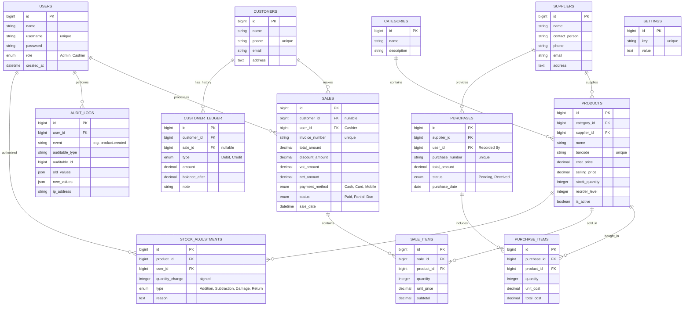

# Smart Inventory POS & Invoice System - Project Analysis

## Features

- User authentication with Admin and Cashier roles
- Product catalog management with categories, subcategories, suppliers, barcode tracking, and stock levels
- Purchase order and stock-in management with invoice numbers, purchase dates, and status tracking
- POS sales workflow with sale items, invoice generation, discounts, VAT calculation, and payment tracking
- Customer management with ledger history for debit, credit, and balance tracking
- Supplier management and purchase item tracking
- Audit logging for user actions, product changes, and sale events
- Settings management for shop details, branding, tax, and SEO metadata
- Low stock and inventory reporting via reorder thresholds
- Barcode scanning support, import/export readiness, and PDF invoice/report generation

## Installation

1. Clone the repository:
   ```bash
   git clone <repo-url> pos-management
   cd pos-management
   ```
2. Install PHP dependencies:
   ```bash
   composer install
   ```
3. Install frontend dependencies:
   ```bash
   pnpm install
   ```
4. Copy the example environment file and configure your database:
   ```bash
   cp .env.example .env
   ```
5. Generate the application key:
   ```bash
   php artisan key:generate
   ```
6. Run database migrations:
   ```bash
   php artisan migrate
   ```
7. Seed the database:
   ```bash
   php artisan db:seed
   ```
8. Build frontend assets:
   ```bash
   pnpm run build
   ```
9. Start the local development server:
   ```bash
   php artisan serve
   ```

## 1. Database Relation Analysis (ERD Schema)

Based on the requirements, here is the proposed database structure with relationships.

### Core Entities & Relationships

| Entity | Description | Relationships |
| :--- | :--- | :--- |
| **User** | System users (Admin, Cashier) | `HasMany` Sales, `HasMany` AuditLogs |
| **Category** | Product classifications | `HasMany` Products |
| **Supplier** | Product providers | `HasMany` Products, `HasMany` Purchases |
| **Product** | Inventory items | `BelongsTo` Category, `BelongsTo` Supplier, `HasMany` SaleItems, `HasMany` StockAdjustments |
| **Purchase** | Stock-in transactions | `BelongsTo` Supplier, `HasMany` PurchaseItems |
| **PurchaseItem** | Individual items in a purchase | `BelongsTo` Purchase, `BelongsTo` Product |
| **Customer** | Clients/Buyers | `HasMany` Sales, `HasMany` CustomerLedger |
| **Sale** | POS transactions (Stock-out) | `BelongsTo` Customer (nullable), `BelongsTo` User, `HasMany` SaleItems |
| **SaleItem** | Individual products in a sale | `BelongsTo` Sale, `BelongsTo` Product |
| **CustomerLedger**| Financial tracking (Due/Debit/Credit) | `BelongsTo` Customer |
| **StockAdjustment**| Manual stock corrections | `BelongsTo` Product, `BelongsTo` User |
| **AuditLog** | System activity tracking | `BelongsTo` User |

### Detailed Table Definitions (SQL View)




---

## 2. System Design Analysis

### Architectural Pattern: Laravel Repository + Service Layer
To ensure the system is scalable and maintainable (as per non-functional requirements), I recommend the following architecture:

1.  **Models (Eloquent)**: Represent the database tables and define relationships (e.g., `Product hasMany SaleItems`).
2.  **Repositories**: Abstraction layer for data fetching. For example, `ProductRepository` handles finding products by barcode or category.
3.  **Service Layer**: Where the "Business Logic" lives.
    *   `SaleService`: Handles the complex logic of creating a sale, updating stock, and updating customer ledger in a single **Transaction**.
    *   `StockService`: Manages inventory levels and reorder alerts.
    *   `InvoiceService`: Generates PDF invoices using a library like `barryvdh/laravel-dompdf`.
4.  **Controllers**: Keep them thin. They should only receive requests and call the appropriate Service.
5.  **Audit Observers**: Use Laravel Observers to automatically record `AuditLog` entries whenever a `Product` or `Sale` is updated.

### Key Module Interactions

*   **POS Module**: 
    1. Cashier scans barcode (handled by **Barcode Management Module**).
    2. Frontend (React) fetches product details via API.
    3. Sale is finalized -> **SaleService** updates stock quantity -> **CustomerLedger** is updated if credit -> **InvoiceService** returns PDF link.
*   **Inventory Module**:
    1. Stock falls below `reorder_level`.
    2. **StockService** triggers a system notification or marks as "Low Stock" for the **Reporting Module**.

---

## 3. Implementation Recommendations (Add-ons)

1.  **Barcode Scanning**: Use a keyboard-wedge scanner. Implement a global listener in the React frontend to capture input into the POS search field automatically.
2.  **Excel Import**: Use `maatwebsite/excel` for Laravel to handle product bulk uploads.
3.  **PDF Generation**: Use Tailwind CSS for the invoice styling to ensure the printed version looks premium and modern.

---

## 4. Requirement Mapping (Traceability Matrix)

This section confirms how each of your specific requirements is addressed in the technical design.

### Must-have features
| Feature | Implementation Detail (Database / System) |
| :--- | :--- |
| **Login + roles** | `USERS` table with `role` enum (Admin, Cashier). |
| **Products (CRUD)** | `PRODUCTS`, `CATEGORIES`, `SUPPLIERS` tables + `ProductController`. |
| **Stock in/out** | `PURCHASES` (Stock In), `SALE_ITEMS` (Stock Out), `STOCK_ADJUSTMENTS`. |
| **POS sales screen** | `SALES` (Invoice tracking), `SALE_ITEMS` (Cart), fast search via barcode. |
| **VAT & Discounts** | `SALES.discount_amount`, `SALES.vat_amount` fields (Net calculation). |
| **Invoice PDF / Print** | `InvoiceService` using Laravel DOMPDF; `sales.invoice_number`. |
| **Customer ledger** | `CUSTOMERS` table + `CUSTOMER_LEDGER` (Debit/Credit history). |
| **Reports** | `ReportController` querying `SALES` (Daily/Weekly) and `PRODUCTS` (Top products, Low stock). |
| **Audit log** | `AUDIT_LOGS` table with `user_id` to track who changed stock or sales. |

### Add-ons
| Feature | Implementation Detail (Database / System) |
| :--- | :--- |
| **Barcode scanner** | `PRODUCTS.barcode` field; JavaScript global listener for keyboard-wedge scanners. |
| **Barcode labels PDF**| `BarcodeService` to generate standard labels from product list to PDF. |
| **Excel Import/Export**| `Maatwebsite/Excel` for both importing and exporting `Product` and `Stock` records. |


