# Smart Inventory POS & Invoice System

<p align="center">
  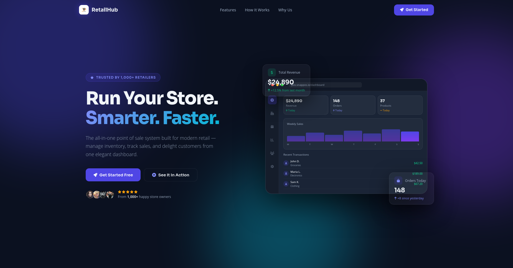
</p>

A comprehensive Point of Sale and Inventory Management System with barcode tracking, audit logging, and automated reporting.

---

## Table of Contents

- [About the Project](#about-the-project)
- [Project Overview](#project-overview)
- [Key Features](#key-features)
- [Tech Stack](#tech-stack)
- [Dependencies](#dependencies)
- [Installation & Setup](#installation--setup)
- [Folder Structure](#folder-structure)
- [Database Relation Analysis](#database-relation-analysis)
- [System Design Analysis](#system-design-analysis)
- [Traceability Matrix](#traceability-matrix)
- [Visual Showcase](#visual-showcase)
- [Contributions](#contributions)
- [License](#license)
- [Contact](#contact)

---

## About the Project 
The **Smart Inventory POS & Invoice System** is a professional-grade solution designed to streamline retail operations. It integrates product cataloging, real-time inventory tracking, and automated sales processing into a single, cohesive platform. By leveraging barcode scanning and automated reporting, it helps businesses eliminate manual errors and gain real-time insights into their performance.

---

## Project Overview  
This project is built using the **Laravel Repository + Service Layer** architectural pattern to ensure high maintainability and scalability. It provides a robust backend for handling complex financial transactions and stock movements, while the frontend offers a responsive interface for both administrators and cashiers.

**Key Metrics & Objectives:**
- **Accuracy:** Real-time stock updates and automated VAT/discount calculations.
- **Accountability:** Full audit trail for every product change and sale transaction.
- **Efficiency:** Fast POS checkout workflow with keyboard-wedge barcode scanner support.

---

## Key Features  
- **User Authentication:** Secure login with role-based access control (Admin, Cashier).
- **Inventory Management:** Full CRUD for products, categories, subcategories, and suppliers with barcode tracking.
- **POS Workflow:** Seamless sales process with cart management, invoice generation, and multiple payment methods (Cash, Card, Mobile).
- **Customer Ledger:** Financial tracking system for managing customer debts, credits, and balance history.
- **Stock-In/Out Tracking:** Managed through purchase orders and stock adjustments with status tracking.
- **Automated Reporting:** Daily/Weekly sales reports, top-product analysis, and low-stock alerts via reorder thresholds.
- **Export/Import Tools:** Bulk product data handling via Excel and barcode label generation to PDF.

---

## Tech Stack  
**Backend:** Laravel 12 · PHP 8.2+  
**Frontend:** React.js · Tailwind CSS 4 · Vite  
**Database:** MySQL · PostgreSQL · SQLite  
**Tools:** Git · VS Code · Composer · PNPM · Docker (Sail)

---

## Dependencies  
List of major libraries and frameworks used:

```json
{
  "php": "^8.2",
  "laravel/framework": "^12.0",
  "barryvdh/laravel-dompdf": "*",
  "maatwebsite/excel": "*",
  "picqer/php-barcode-generator": "*",
  "tailwindcss": "^4.0.0",
  "vite": "^7.0.7"
}
```

---

## Installation & Setup  
1. **Clone the repository:**
   ```bash
   git clone <repo-url> pos-management
   cd pos-management
   ```
2. **Install PHP dependencies:**
   ```bash
   composer install
   ```
3. **Install frontend dependencies:**
   ```bash
   pnpm install
   ```
4. **Environment Configuration:**
   ```bash
   cp .env.example .env
   php artisan key:generate
   ```
   *Configure your database credentials in the `.env` file.*
5. **Database Setup:**
   ```bash
   php artisan migrate --seed
   ```
6. **Build Frontend Assets:**
   ```bash
   pnpm run build
   ```
7. **Start the Server:**
   ```bash
   php artisan serve
   ```

---

## Folder Structure  
```text
app/
├── Http/
│   ├── Controllers/    # Thin controllers
│   ├── Requests/       # Form validations
├── Models/             # Eloquent entities
├── Repositories/       # Data abstraction layer
├── Services/           # Business logic (SaleService, StockService, etc.)
database/
├── migrations/         # Database schema
├── seeders/            # Initial roles and data
resources/
├── js/                 # React components and logic
├── views/              # Blade templates
```

---

## Database Relation Analysis

### Core Entities & Relationships

| Entity | Description | Relationships |
| :--- | :--- | :--- |
| **User** | System users (Admin, Cashier) | `HasMany` Sales, `HasMany` AuditLogs |
| **Category** | Product classifications | `HasMany` Products |
| **Supplier** | Product providers | `HasMany` Products, `HasMany` Purchases |
| **Product** | Inventory items | `BelongsTo` Category, `BelongsTo` Supplier, `HasMany` SaleItems, `HasMany` StockAdjustments |
| **Purchase** | Stock-in transactions | `BelongsTo` Supplier, `HasMany` PurchaseItems |
| **PurchaseItem** | Individual items in a purchase | `BelongsTo` Purchase, `BelongsTo` Product |
| **Customer** | Clients/Buyers | `HasMany` Sales, `HasMany` CustomerLedger |
| **Sale** | POS transactions (Stock-out) | `BelongsTo` Customer (nullable), `BelongsTo` User, `HasMany` SaleItems |
| **SaleItem** | Individual products in a sale | `BelongsTo` Sale, `BelongsTo` Product |
| **CustomerLedger**| Financial tracking (Due/Debit/Credit) | `BelongsTo` Customer |
| **StockAdjustment**| Manual stock corrections | `BelongsTo` Product, `BelongsTo` User |
| **AuditLog** | System activity tracking | `BelongsTo` User |

### ER Diagram (Mermaid)

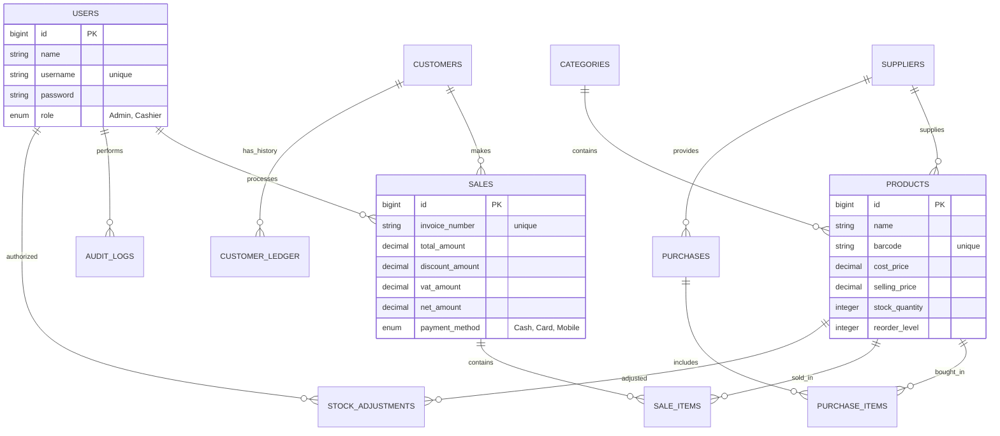

---

## System Design Analysis

### Architectural Pattern: Repository + Service Layer
1.  **Models (Eloquent)**: Represent the database tables and define relationships.
2.  **Repositories**: Abstraction layer for data fetching (e.g., finding products by barcode).
3.  **Service Layer**: Handles "Business Logic" (e.g., `SaleService` manages transactions, updates stock, and customer ledger in a single DB transaction).
4.  **Audit Observers**: Automatically record `AuditLog` entries whenever sensitive data (Product/Sale) is modified.

### Key Module Interactions
- **POS Module**: Cashier scans barcode -> Frontend fetches details -> Sale finalized -> `SaleService` updates stock -> `CustomerLedger` updated -> `InvoiceService` generates PDF.
- **Inventory Module**: Stock falls below `reorder_level` -> System triggers "Low Stock" alert for reporting.

---

## Traceability Matrix

| Feature | Implementation Detail |
| :--- | :--- |
| **Login + Roles** | `USERS` table with role enums; Middleware for access control. |
| **Products (CRUD)** | `PRODUCTS`, `CATEGORIES`, `SUPPLIERS` tables + `ProductController`. |
| **Stock In/Out** | `PURCHASES` (In), `SALE_ITEMS` (Out), `STOCK_ADJUSTMENTS`. |
| **POS Interface** | Fast search via barcode; `SALES` and `SALE_ITEMS` tracking. |
| **VAT & Discounts** | Financial fields in `SALES` table for precise net calculation. |
| **Invoice PDF** | `InvoiceService` using Laravel DOMPDF. |
| **Customer Ledger** | `CUSTOMERS` table + `CUSTOMER_LEDGER` debit/credit history. |
| **Audit Log** | `AUDIT_LOGS` table with user-to-action mapping. |

---

## Visual Showcase

### 🏠 Home & Landing
<p align="center">
  
  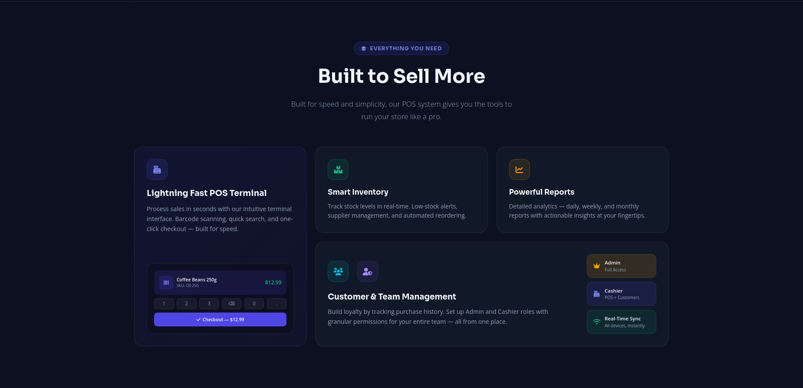
</p>

### 🔐 Authentication
<p align="center">
  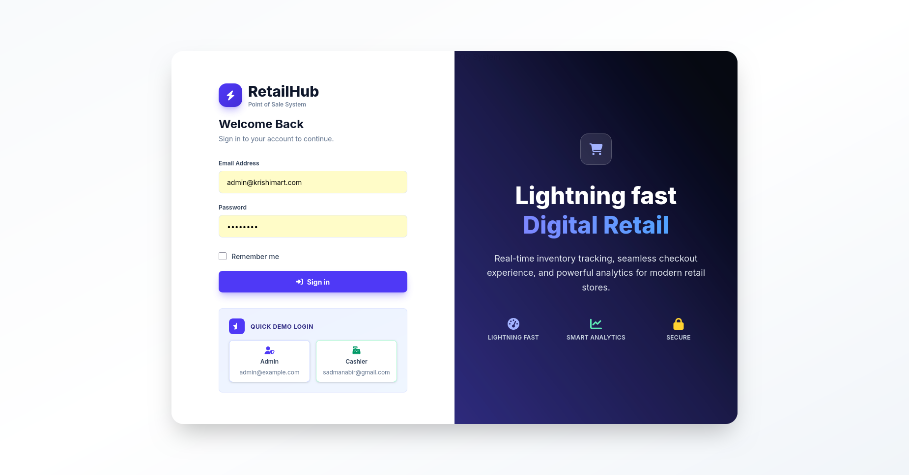
</p>

### 🛠️ Admin Management
<p align="center">
  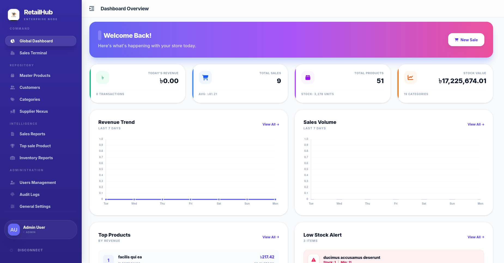
  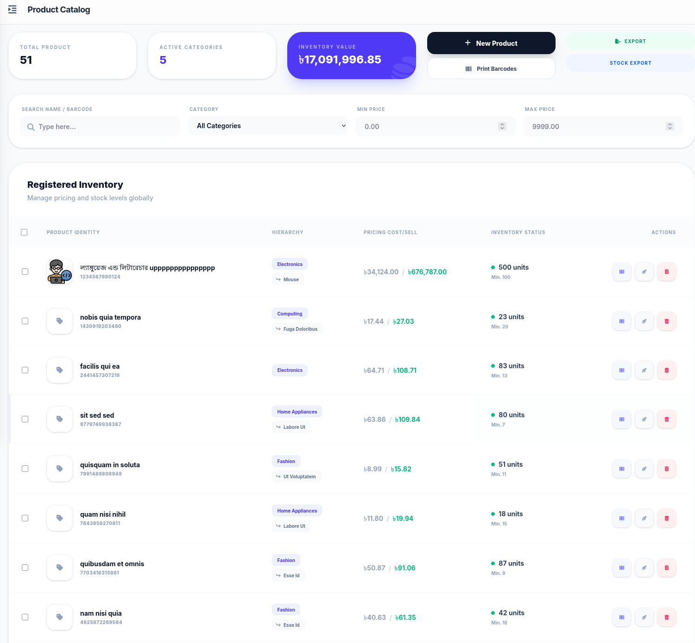
</p>
<p align="center">
  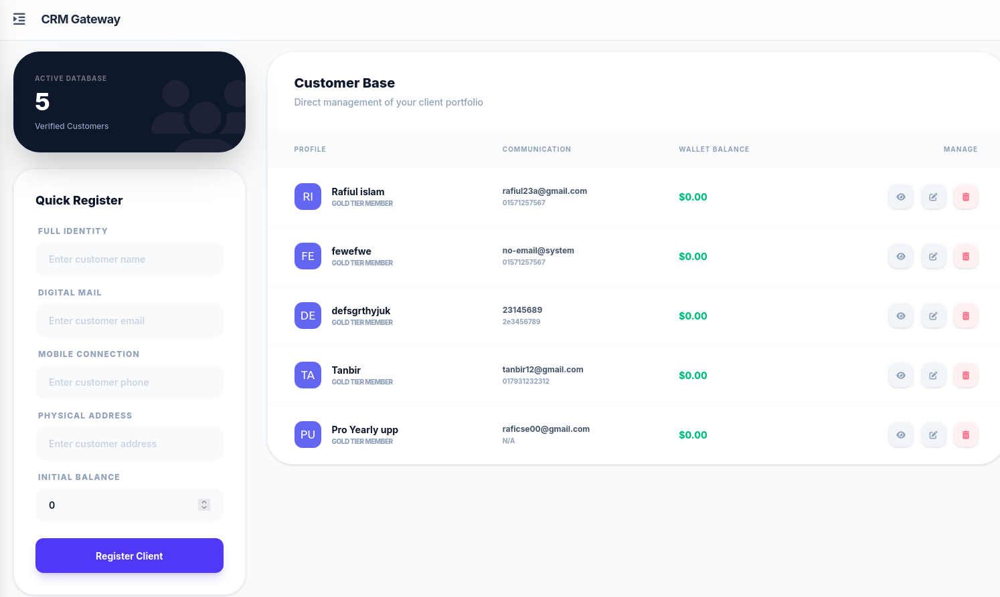
  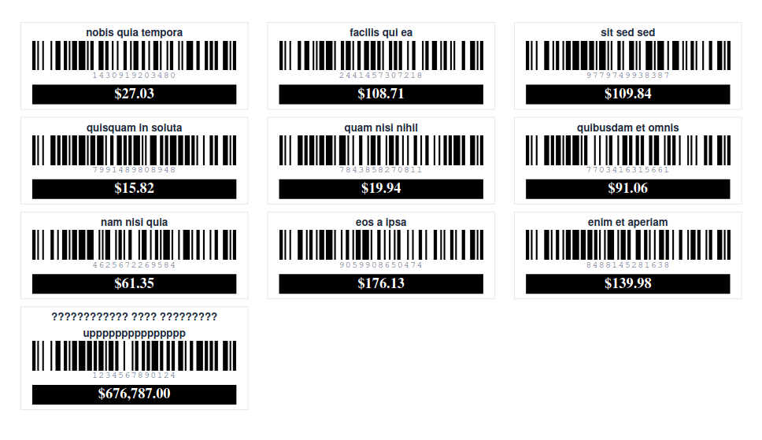
</p>
<p align="center">
  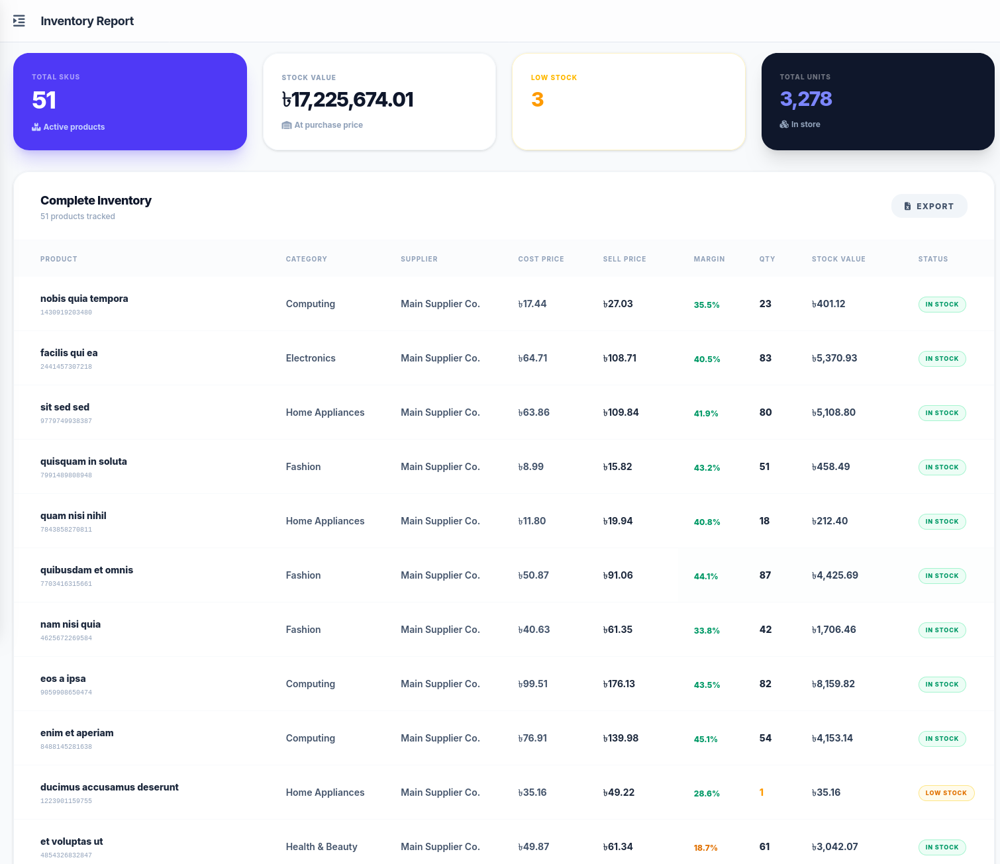
  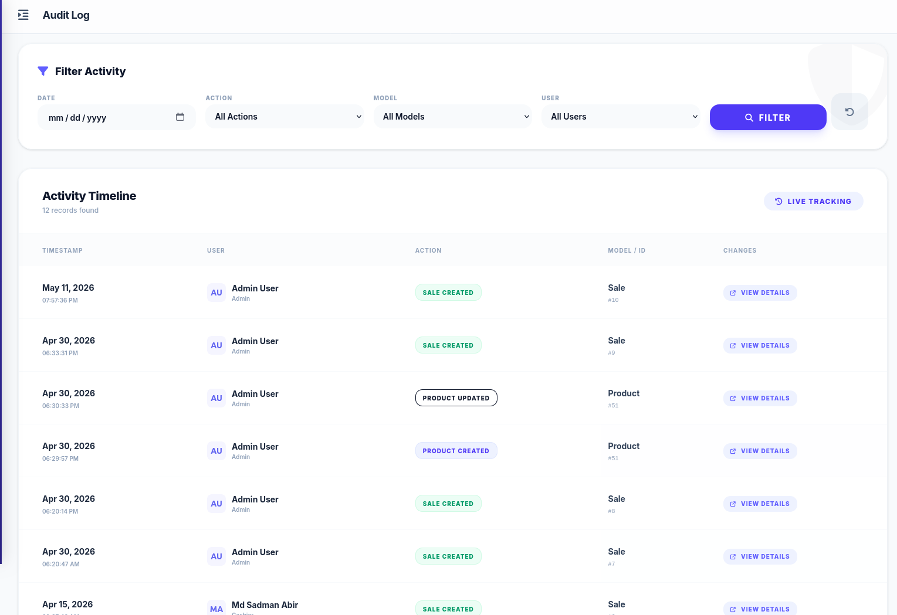
</p>

### 🛒 Cashier & POS Terminal
<p align="center">
  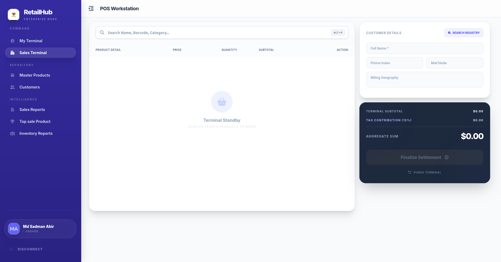
  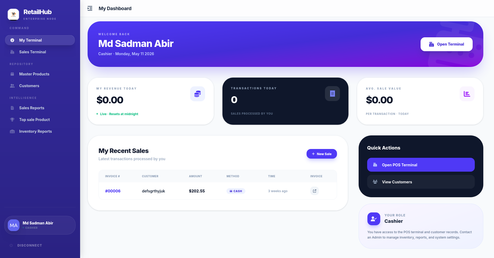
</p>

---

## Contributions
Contributions are what make the open source community such an amazing place to learn, inspire, and create. Any contributions you make are **greatly appreciated**.

1. Fork the Project
2. Create your Feature Branch (`git checkout -b feature/AmazingFeature`)
3. Commit your Changes (`git commit -m 'Add some AmazingFeature'`)
4. Push to the Branch (`git push origin feature/AmazingFeature`)
5. Open a Pull Request

---

## License
Distributed under the MIT License. See `LICENSE` for more information.

---

## Contact
**Project Maintainer:** Md Rafiul Islam  
**Project Link:** [https://github.com/Rafiul29/point-of-sale.git](https://github.com/Rafiul29/point-of-sale.git)
